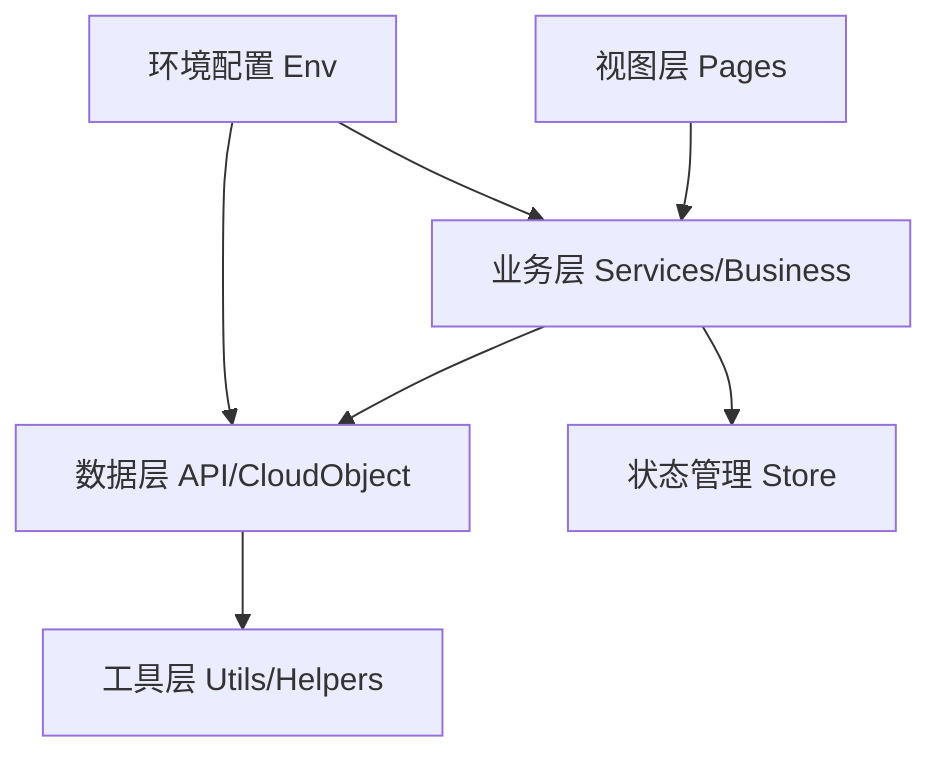

## Product Overview

针对 hxzyL uni-app 项目进行全面代码优化，解决已识别的安全、架构、性能和代码质量问题，提升项目的可维护性、安全性和执行效率。

## Core Features

- 修复安全问题：移除硬编码的 API 密钥，实现安全的密钥管理
- 消除代码重复：提取公共工具函数（时间格式化、云对象初始化等）
- 统一错误处理：建立全局错误处理机制和统一的错误反馈
- 日志管理优化：清理生产环境日志，实现分级日志系统
- 代码架构重构：实现代码分层（视图层、业务层、数据层、工具层）
- 环境管理优化：实现开发/测试/生产环境的配置分离
- 状态管理规范化：统一状态管理方案，消除混乱状态
- 性能优化：优化列表渲染、图片加载、代码分割等性能瓶颈

## Tech Stack

- 前端框架：uni-app (基于 Vue 2/3)
- 开发语言：JavaScript/TypeScript
- 状态管理：Vuex/Pinia
- 云服务：腾讯云云函数、云对象

## Tech Architecture

### System Architecture

采用分层架构模式，将项目分为视图层、业务层、数据层和工具层。确保单向数据流和清晰的职责划分。



### Module Division

- **Utils 模块**：公共工具函数（时间处理、数据验证、云对象初始化）
- **Services 模块**：业务逻辑封装（API调用、云函数调用）
- **Config 模块**：环境配置管理（开发、测试、生产环境）
- **Error Handling 模块**：全局错误捕获和统一错误处理
- **Logger 模块**：分级日志系统（开发、生产环境不同级别）

### Data Flow

用户操作 → 视图层事件触发 → 业务层处理 → 数据层请求 → 响应处理 → 状态更新 → 视图层更新

## Implementation Details

### Core Directory Structure

```
project-root/
├── utils/                 # 新增/重构：工具函数库
│   ├── dateHelper.js      # 新增：时间格式化工具
│   ├── cloudInit.js       # 新增：云对象初始化工具
│   └── validator.js       # 新增：数据验证工具
├── services/              # 新增：业务逻辑层
│   ├── apiService.js      # 新增：API请求封装
│   └── cloudService.js    # 新增：云函数/云对象调用封装
├── config/                # 新增：配置管理
│   ├── env.js             # 新增：环境变量配置
│   └── constants.js       # 新增：常量定义
├── store/                 # 重构：状态管理规范化
│   ├── modules/           # 模块化状态
│   └── index.js
├── common/                # 重构：公共组件和资源
│   ├── errorHandler.js    # 新增：全局错误处理
│   └── logger.js          # 新增：日志系统
└── pages/                 # 现有：页面层（保持结构）
```

### Key Code Structures

**环境配置管理**：实现多环境配置切换，避免硬编码敏感信息。

```javascript
// config/env.js
const envConfig = {
  development: { apiBaseUrl: '...', logLevel: 'debug' },
  production: { apiBaseUrl: '...', logLevel: 'error' }
};
export default envConfig[process.env.NODE_ENV];
```

**统一云对象初始化**：封装云对象初始化逻辑，避免重复代码。

```javascript
// utils/cloudInit.js
export function getCloudObject(name) {
  return uniCloud.importObject(name, {
    customUI: false,
    loadingOptions: { title: '加载中...' }
  });
}
```

**全局错误处理**：统一的错误捕获和处理机制。

```javascript
// common/errorHandler.js
export function handleError(error, context = '') {
  const errorMsg = extractErrorMessage(error);
  logError(context, errorMsg);
  showUserToast(errorMsg);
  // 可选：上报错误到监控系统
}
```

### Technical Implementation Plan

1. **问题陈述**：代码存在大量重复、安全隐患和架构混乱
2. **解决方案**：系统化重构，从基础工具到业务逻辑分层优化
3. **关键步骤**：

- 建立环境和配置管理基础
- 提取公共工具函数消除重复
- 实现分层架构和统一错误处理
- 优化状态管理和性能

4. **测试策略**：功能测试、性能对比测试、安全审计

### Integration Points

- 页面层通过业务层调用数据层，不再直接调用云对象
- 统一使用错误处理器捕获所有异步错误
- 日志系统集成到关键业务流程中

## Technical Considerations

### Logging

- 开发环境：debug级别，输出详细日志
- 生产环境：error级别，仅记录错误和关键信息
- 使用统一日志接口，便于后续接入日志平台

### Performance Optimization

- 图片懒加载和压缩
- 长列表虚拟滚动（如适用）
- 避免频繁的状态更新，使用防抖/节流
- 路由懒加载

### Security Measures

- API 密钥通过环境变量或云函数后端获取
- 敏感数据不在本地存储
- 输入验证和XSS防护
- HTTPS强制使用

### Scalability

- 工具函数易于扩展和维护
- 服务层可平滑迁移到其他方案
- 模块化设计支持功能扩展

## Agent Extensions

### SubAgent

- **code-explorer**
- Purpose: 全面审查项目代码结构，定位代码重复、硬编码和安全问题
- Expected outcome: 生成代码问题清单和优化建议，识别所有需要重构的文件和模块